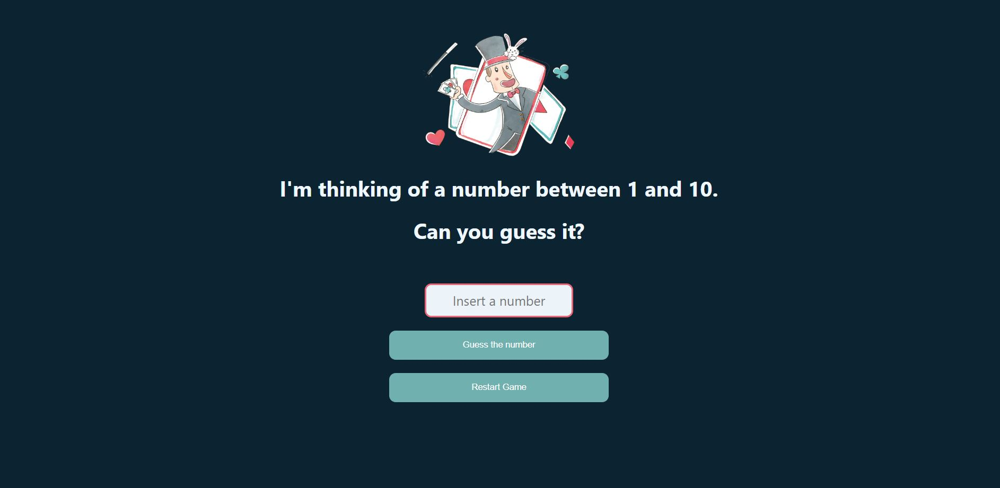

# Guess the Number Game

This is a simple web-based game where the player is required to guess a number between 1 and 10. The game will provide feedback to the player after each guess, informing them whether their guess is too high, too low, or correct. The player has a limited number of attempts to guess the correct number.

## Getting Started

1. Clone the repository to your local machine.
2. Open the index.html file in your preferred browser.

## How to Play

1. The player must enter a number between 1 and 10 in the input field.
2. Click on the "Guess" button to submit the guess.
3. If the guess is incorrect, the game will inform the player whether their guess is too high or too low, and how many attempts they have remaining.
4. The player must keep guessing until they guess the correct number or run out of attempts.
5. If the player correctly guesses the number, the game will inform them of how many attempts it took them to guess the number.
6. If the player runs out of attempts without guessing the correct number, the game will inform them that they have lost and tell them what was the number.

## Technologies Used

- HTML
- CSS
- JavaScript

## Preview

